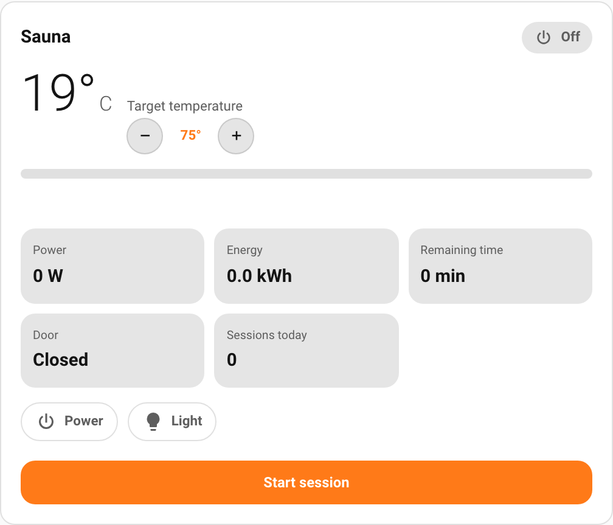
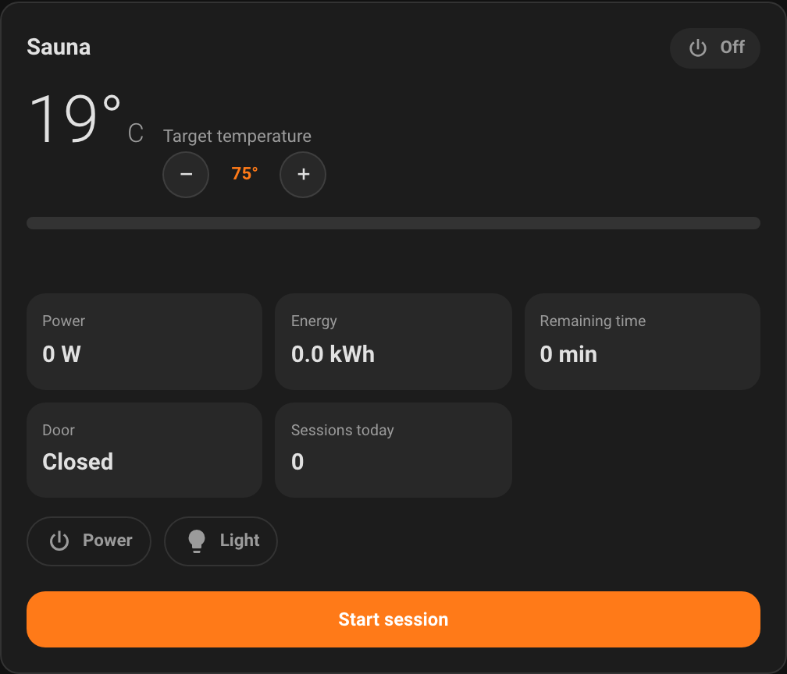
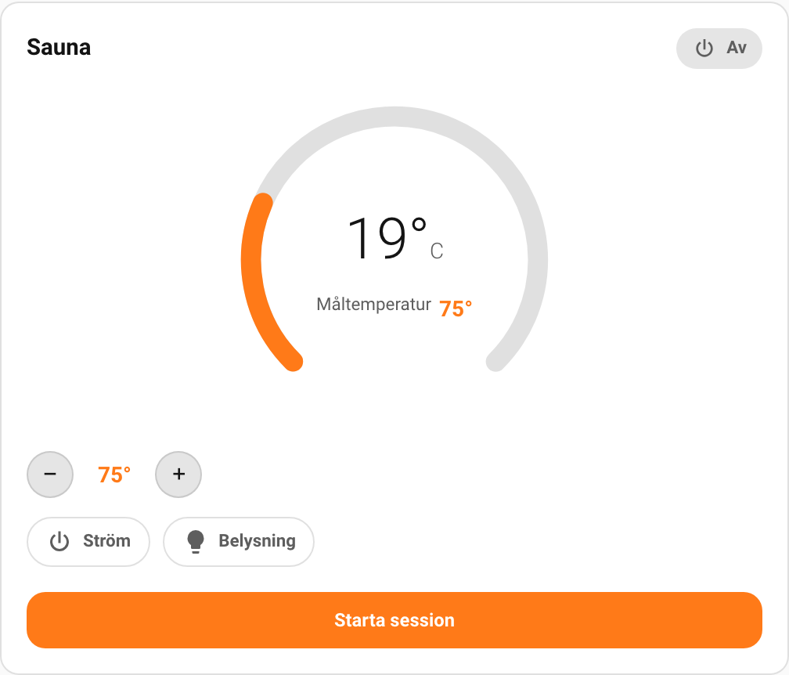
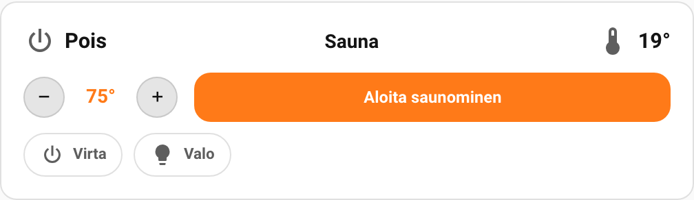
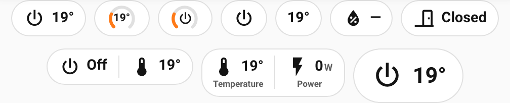

# sauna-card

[![License][license-shield]](LICENSE)
[![hacs][hacsbadge]][hacs]

A Lovelace custom card **and badge** for Home Assistant that show and control
**Harvia sauna heaters**. Built for the
[`ha-harvia-sauna`](https://github.com/WiesiDeluxe/ha-harvia-sauna) integration
(Xenio WiFi via myHarvia, Fenix via harvia.io), with a modular adapter design so
more sauna models and integrations can be added over time. Theme-first,
multilingual (sv/fi/en/de), and configurable down to which value sits in which
slot.

<p align="center">
  
  
</p>

| Status dashboard | Thermostat dial | Compact |
|:---:|:---:|:---:|
|  |  |  |

The companion **badge**, in several appearances:



## Features

- **Show and control in one card** — current/target temperature with a stepper,
  start/stop a session, and toggle power, light, fan and steamer.
- **Three theme-first layouts** — `status-dashboard` (default), `thermostat-hero`
  (a 270° dial) and `compact` — all styled with Home Assistant CSS variables, no
  hard-coded colours.
- **Configure what each layout shows.** Pick from **every** value the integration
  exposes (44 of them): temperatures, humidity, remaining time, power, energy,
  sessions, door/heating/steam, the auxiliary switches, and diagnostics. Each
  layout keeps its own selection.
- **Reorderable tiles** (dashboard/thermostat) and **left/middle/right slots**
  (compact), edited in the visual editor — drag or ▲▼, add/remove, reset.
- **A companion badge** for dashboard badge rows, with the same value catalog and
  six appearances (chip, icon, value, and three gauge variants).
- **Auto-detection** — finds your Harvia device automatically; no entity IDs to
  type. Resolves entities by their translation key, so localized entity IDs don't
  matter.
- **Multilingual** — Swedish, Finnish, English, German out of the box (more on
  request), following Home Assistant's locale, with a per-card override.
- **Visual editor** and **card-picker suggestion** on Home Assistant 2026.6+.

## Requirements

The [`ha-harvia-sauna`](https://github.com/WiesiDeluxe/ha-harvia-sauna)
integration, installed and set up for your heater (Harvia **Xenio WiFi** or
**Fenix**). The card auto-detects the device it controls.

## Installation

### HACS (recommended)

1. HACS → ⋮ → **Custom repositories**.
2. Add `https://github.com/krissen/sauna-card` with category **Dashboard**.
3. Install **sauna-card**, then reload your browser.

### Manual

Download `sauna-card.js` from the
[latest release](https://github.com/krissen/sauna-card/releases) (or build it
yourself with `npm run build`), copy it to `config/www/community/sauna-card/`,
and add a dashboard resource (Settings → Dashboards → ⋮ → Resources):

```
/local/community/sauna-card/sauna-card.js   (type: JavaScript Module)
```

## Basic usage

The card and badge auto-detect the device, so the minimal config is just:

```yaml
type: custom:sauna-card
```

A badge (in a view's `badges:` list):

```yaml
type: custom:sauna-badge
```

Pick a layout and tailor its content in the visual editor, or in YAML — see the
[configuration reference](docs/configuration.md).

## Documentation

- [Installation](docs/installation.md)
- [Quick start](docs/quick-start.md)
- [Configuration reference](docs/configuration.md) — every card and badge option,
  the value catalog, and examples
- [Localization](docs/localization.md)
- [Troubleshooting](docs/troubleshooting.md)

## Support

- **Bugs:** [GitHub Issues](https://github.com/krissen/sauna-card/issues)
- **Docs:** the [`docs/`](docs/) folder

## License

[MIT](LICENSE) © Kristian Niemi

[license-shield]: https://img.shields.io/github/license/krissen/sauna-card.svg
[hacs]: https://github.com/hacs/integration
[hacsbadge]: https://img.shields.io/badge/HACS-Custom-orange.svg
