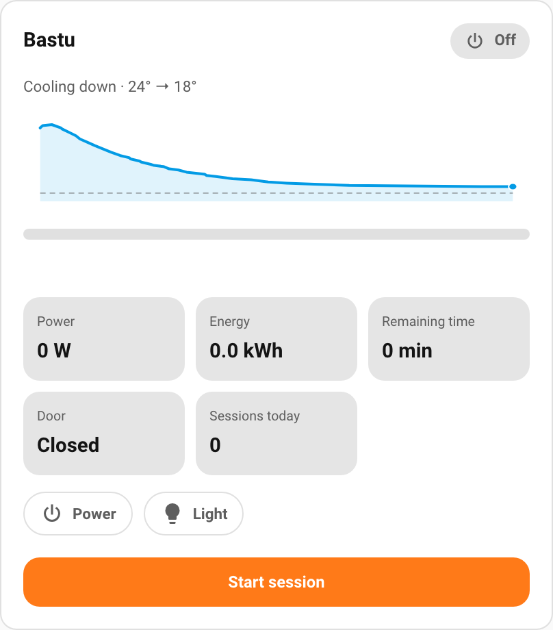

# Configuration

Everything can be set in the **visual editor**; this page is the YAML reference.
The card and badge auto-detect the Harvia device, so most options are optional.

- [Card options](#card-options)
- [Layouts](#layouts)
- [Choosing what to show](#choosing-what-to-show) — tiles, slots, the value catalog
- [Controls](#controls)
- [Badge options](#badge-options)
- [Advanced](#advanced) — version banner, debug logging
- [Examples](#examples)

## Card options

| Name | Type | Default | Description |
|------|------|---------|-------------|
| `type` | `string` | **Required** | `custom:sauna-card`. |
| `name` | `string` | *(device name)* | Card title. |
| `integration` | `string` | *(auto)* | Source: auto-detected `harvia_sauna`, or `manual` for [manual mapping](#manual-mapping). |
| `device_id` | `string` | *(auto)* | Device within the integration; auto-selected when omitted. Not used by `manual`. |
| `entity_map` | `object` | *(none)* | `manual` source only: logical key → entity ID. See [Manual mapping](#manual-mapping). |
| `layout` | `string` | `status-dashboard` | `status-dashboard`, `thermostat-hero`, or `compact`. |
| `controls` | `string` | `power+temp` | Interactive controls: `none`, `power`, or `power+temp`. See [Controls](#controls). |
| `remote_off_action` | `string` | `disable_start` | What the card does while the mapped "remote control allowed" entity is off (and the sauna is off, so a start is what's blocked). See [Remote-off action](#remote-off-action). |
| `language` | `string` | *(HA locale)* | Locale override (`sv`, `fi`, `en`, `de`, …). |
| `tap_more_info` | `boolean` | `true` | Tap a read-only value (tile, slot, the big temperature, the status badge) to open Home Assistant's more-info dialog for its entity. Interactive controls are unaffected. |
| `show_heatup_graph` | `boolean` | `true` | Show the rising temperature curve in the main area while heating. |
| `show_cooldown_graph` | `boolean` | `true` | Show the falling temperature curve after a session, while cooling down. |
| `cooldown_target_temp` | `number` | *(auto)* | Temperature (°C) the cooldown tracks toward — roughly room temperature. Auto-detected from the session's start temperature, falling back to **25 °C** when that isn't known (e.g. after a page reload). Set it explicitly for an exact baseline. |
| `cooldown_include_heatup` | `boolean` | `true` | Extend the cooldown curve back over the heatup so one two-tone curve shows the whole session. |
| `dashboard_tiles` | `array<string>` | *(see below)* | Ordered item keys shown as tiles in `status-dashboard`. |
| `hero_items` | `array<string>` | `[]` | Ordered item keys shown as tiles in `thermostat-hero`. |
| `compact_slots` | `object` | `{left: status, mid: name, right: current_temp}` | The compact layout's three slots. |
| `show_version` | `boolean` | `true` | Log a version banner to the browser console once on load. See [Advanced](#advanced). |
| `debug` | `boolean` | `false` | Emit verbose `console.debug` logging for diagnostics. See [Advanced](#advanced). |

Each content option is **saved per layout** — switching layouts never clears
another layout's selection. Leaving an option unset uses its default; setting an
empty list (`[]`) shows nothing.

## Manual mapping

For a non-Harvia sauna, set `integration: manual` and map your own entities with
`entity_map` (logical key → entity ID). The editor builds this for you: set
**Source → Custom mapping**, then tick each type and pick its entity. The card
renders only what you map.

```yaml
type: custom:sauna-card
integration: manual
entity_map:
  thermostat: climate.my_sauna
  power: switch.my_sauna_power
  light: switch.my_sauna_light
  humidity: sensor.my_sauna_humidity
  door: binary_sensor.my_sauna_door
```

The full list of mappable types, the controls, and a ready-made example fixture
are in [Integrations and compatibility → Manual mapping](integrations.md#manual-mapping).

## Temperature graph

While the sauna runs, the card's main area shows a live temperature graph in place
of the static current/target display. It has three phases, each controlled by the
options above:

- **Heat-up** (`show_heatup_graph`) — a rising curve toward the target while the
  heater is on.
- **Cool-down** (`show_cooldown_graph`, `cooldown_target_temp`) — a falling curve
  toward room temperature after the session ends.
- **Whole session** (`cooldown_include_heatup`) — one two-tone arc: the orange
  heat-up rising to the peak, then the blue cool-down falling.

| Heat-up | Cool-down | Whole session |
|:---:|:---:|:---:|
|  |  |  |

The cool-down is reconstructed from the recorder after a page reload out of the
box (falling toward ~25 °C when the room temperature isn't known). Set
`cooldown_target_temp` to your actual room temperature for an exact baseline.

## Layouts

- **`status-dashboard`** (default) — big current temperature, a target stepper, a
  heating progress bar, a grid of tiles, control chips and a start/stop button.
- **`compact`** — a single row of three slots, with an optional controls row.
- **`thermostat-hero`** — a 270° temperature dial; the same controls and an
  optional tile row below.

## Choosing what to show

`status-dashboard` and `thermostat-hero` render an **ordered list** of tiles
(`dashboard_tiles` / `hero_items`); `compact` renders three **slots**
(`compact_slots`). The list/slot values are **item keys** from the catalog below.
A `compact_slots` value may also be `name` (the device name) or `none`/empty.

Items **hide when their entity is absent or disabled** in the integration — many
diagnostics are disabled by default, so they only appear once you enable them.

Default `dashboard_tiles`: `humidity`, `power`, `energy`, `remaining`, `door`,
`sessions`.

### Value catalog

| Key | Shows |
|-----|-------|
| `status` | Overall status (off / heating / ready / idle) |
| `current_temp` · `target_temp` | Current / target temperature |
| `eta` | Estimated time until ready |
| `humidity` · `target_humidity` | Humidity / target humidity |
| `temp_trend` | Temperature change per minute |
| `remaining` · `session_length` | Remaining time / configured session length |
| `power` · `energy` | Power draw (W) / energy (kWh) |
| `sessions` | Sessions today |
| `last_session_duration` · `last_session_max_temp` | Previous session duration / peak temp |
| `aroma_level` | Aroma intensity (%) |
| `wifi` | Wi-Fi signal (dBm) |
| `door` · `heating` · `steam` | Door, heating element, steam state |
| `power_switch` · `light` · `fan` · `steamer` · `aroma` · `dehumidifier` · `auto_light` · `auto_fan` | On/off of each switch |
| `heater_power_actual` | Actual heater output (W) |
| `main_sensor_temp` · `ext_sensor_temp` · `panel_temp` | Probe temperatures |
| `status_codes` · `active_profile` | Raw status codes / active profile |
| `heat_on_counter` · `steam_on_counter` · `ph1_relay_counter` · `ph2_relay_counter` · `ph3_relay_counter` | Lifetime cycle/relay counters |
| `total_hours` · `total_bathing_hours` · `total_sessions` | Lifetime totals |
| `remote_allowed` · `safety_relay` · `screen_lock` | Diagnostic binaries |

## Controls

`controls` governs the interactive elements on every layout:

| Value | Shows |
|-------|-------|
| `power+temp` *(default)* | Temperature stepper + start/stop + chips. |
| `none` | Display only — no stepper, start/stop or chips. |
| `power` | Start/stop button + control chips. |

On `compact`, any value other than `none` adds a controls row (so the compact
layout becomes interactive).

## Remote-off action

`remote_off_action` gates the card on a "remote control allowed" entity — handy
when the heater only permits remote start under certain conditions. It engages
while that entity is **off** and the sauna is **off** (so a *start* is what's
blocked; stopping a running sauna is never blocked). In every non-`none` mode the
status pill swaps its icon for a **lock** — a visual cue that reads without hover
(no tooltip or banner). Needs a `remoteAllowed` entity: Harvia exposes one; for
manual mapping, map your "remote start allowed" binary sensor. With no such entity
present nothing changes, so the default is safe — set `none` to opt out entirely.

| Value | While remote control is off |
|-------|------------------------------|
| `disable_start` *(default)* | Disable just the start button (faded). |
| `compact` | Switch to the compact layout; start disabled. |
| `compact_locked` | Switch to compact; all controls disabled. |
| `hide_controls` | Remove the controls entirely — display-only. |
| `lock` | Disable all controls (stepper, chips and start). |
| `none` | Ignore — normal card. |

The `compact` modes use the card's `compact_slots` (falling back to the
defaults). A tidier alternative to hiding the whole card with a conditional card.

## Badge options

| Name | Type | Default | Description |
|------|------|---------|-------------|
| `type` | `string` | **Required** | `custom:sauna-badge`. |
| `name` | `string` | *(device name)* | Override label / aria text. |
| `integration` · `device_id` · `language` | `string` | *(auto)* | As for the card. |
| `content` | `string` | `primary` | `primary` (status + temperature), `row` (several values), or `single` (one value). |
| `visual` | `string` | `chip` | `chip`, `icon`, `ring`, `ring_icon`, `ring_value`, or `value`. |
| `single_item` | `string` | `current_temp` | The value shown when `content: single` (a catalog key). |
| `items` | `array<string>` | `[status, current_temp, humidity]` | The values shown when `content: row`. |
| `show_label` | `boolean` | `false` | Show each value's label. |
| `label_position` | `string` | `right` | `right` or `below` (when `show_label`). |
| `scale` | `number` | `1` | Overall size multiplier (any positive number; the editor slider offers 0.5–3). |
| `show_version` | `boolean` | `true` | Log a version banner to the browser console once on load. See [Advanced](#advanced). |
| `debug` | `boolean` | `false` | Emit verbose `console.debug` logging for diagnostics. See [Advanced](#advanced). |

## Advanced

Both the card and the badge expose two diagnostic options, grouped in a folded
**Advanced** section at the bottom of the visual editor. They are safe to leave
at their defaults.

| Name | Type | Default | Description |
|------|------|---------|-------------|
| `show_version` | `boolean` | `true` | On first load, print a styled version banner (`♨️ Sauna Card: version X.Y.Z`) to the browser console. Useful when reporting an issue. Set `false` to silence it. Omitting the option keeps it on, so existing cards keep logging. |
| `debug` | `boolean` | `false` | When on, the card/badge writes verbose `console.debug` lines (prefixed `[sauna-card]`) covering integration detection, service calls, and graph/session computation. Leave off for normal use. |

```yaml
type: custom:sauna-card
show_version: false   # don't log the version banner
debug: true           # verbose console.debug diagnostics
```

The editor also shows the running build version in the Advanced section, so you
can confirm which version is loaded without opening the console.

## Examples

Default card (auto-detected device):

```yaml
type: custom:sauna-card
```

A status dashboard with a custom tile list:

```yaml
type: custom:sauna-card
layout: status-dashboard
dashboard_tiles:
  - current_temp
  - target_temp
  - humidity
  - remaining
  - heating
  - steam
```

A read-only compact card showing status, temperature and the door:

```yaml
type: custom:sauna-card
layout: compact
controls: none
compact_slots:
  left: status
  mid: current_temp
  right: door
```

A gauge badge, and a labelled multi-value badge:

```yaml
# in a view's badges: list
- type: custom:sauna-badge
  visual: ring_value
- type: custom:sauna-badge
  content: row
  items: [current_temp, humidity, power]
  show_label: true
  label_position: below
```
