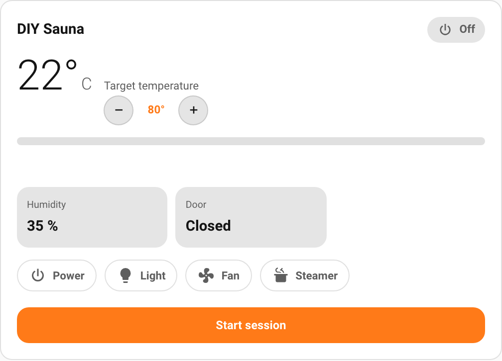

# Integrations and compatibility

`sauna-card` talks to a sauna through an **adapter**. Today there are two sources
to choose from:

- **[Harvia (`ha-harvia-sauna`)](https://github.com/WiesiDeluxe/ha-harvia-sauna)**
  — auto-detected. Harvia **Xenio WiFi** (via myHarvia) and **Fenix** (via
  harvia.io).
- **Manual mapping** — point the card at your own Home Assistant entities. For
  DIY / KNX / non-Harvia saunas, or any setup that exposes a `climate` entity
  plus some switches and sensors.

The card auto-detects a Harvia device when the integration is installed; for
everything else, pick **Custom mapping** in the editor. More integrations can be
added over time — the adapter framework is built for it (see
[Adding a sauna model or integration](dev/adding-an-integration.md)).

| Source | How it's selected | Notes |
|--------|-------------------|-------|
| **Harvia** (`harvia_sauna`) | Auto-detected; no entity IDs to type. | Needs the [`ha-harvia-sauna`](https://github.com/WiesiDeluxe/ha-harvia-sauna) integration installed and set up. Surfaces the full value catalog (temperatures, humidity, remaining time, power/energy, door/heating/steam, the auxiliary switches and diagnostics). Resolves entities by translation key, so localized/renamed entity IDs don't matter. |
| **Manual mapping** (`manual`) | Chosen explicitly in the editor (**Source → Custom mapping**), then you map each entity. | Works with any sauna. The card renders only the types you map and hides the rest. Controls are generic (see below). |

## Source previews

| Harvia (`status-dashboard`) | Manual mapping (DIY sauna) |
|:---:|:---:|
|  |  |

## Manual mapping

A homemade or non-Harvia sauna has no Harvia device to detect, so you map its
entities yourself. The set of mappable **types** is the same catalog the Harvia
adapter understands, so a mapped sauna renders just like a Harvia one — for
whatever entities you have.

### In the visual editor

1. Add a **Sauna Card** to your dashboard and open its editor.
2. Set **Source** to **Custom mapping**.
3. The **Entity mapping** list appears directly under the source picker (foldable,
   open by default). It lists every type the card can show, all unticked.
4. Tick each type your sauna has, then **pick the entity** (or type its entity ID)
   in the field that appears. Untick a type to drop it.

That's it — the card shows the mapped values and controls, and hides everything
you didn't map.

### What to map

The `climate` entity is the anchor: it provides the current and target
temperature and the on/heating status (from its `current_temperature` /
`temperature` attributes and `hvac_action`). Everything else is optional.

| Type | Domain | Gives you |
|------|--------|-----------|
| **Thermostat** | `climate` | Current + target temperature, status, the temperature stepper |
| **Power** | `switch` / `light` / `fan` / `input_boolean` | The power button (start/stop) and power chip |
| **Temperature**, **Target temperature** | `sensor` | Override the climate attributes if you have dedicated sensors |
| **Light**, **Fan**, **Steamer** | `switch` / `light` / `fan` / `input_boolean` | Toggle chips |
| **Humidity** | `sensor` | Humidity tile |
| **Door**, **Heating** | `binary_sensor` | Door state / heating indicator |
| **Power (W)**, **Energy (kWh)**, … | `sensor` | The matching tiles |

The remaining catalog types (session counters, lifetime totals, extra probes,
Harvia diagnostics) are offered too, but most DIY saunas won't have them.

### Controls

Manual mapping uses standard, integration-agnostic Home Assistant services, so
controls just work:

- **Temperature stepper** → `climate.set_temperature` on the mapped thermostat.
- **Power button** → switches the mapped power entity on/off
  (`homeassistant.turn_on` / `turn_off`).
- **Toggle chips** (light/fan/steamer/…) → `homeassistant.toggle`, which is why a
  toggle can be a `switch`, `light`, `fan` or `input_boolean` entity.

If you map a thermostat but no power entity, the power button is hidden — control
the heater with the temperature stepper (or the thermostat's own more-info
dialog).

### YAML

The editor writes a plain `entity_map` (logical key → entity ID). You can also
write it by hand:

```yaml
type: custom:sauna-card
integration: manual
entity_map:
  thermostat: climate.my_sauna
  power: switch.my_sauna_power
  light: switch.my_sauna_light
  fan: switch.my_sauna_fan
  humidity: sensor.my_sauna_humidity
  door: binary_sensor.my_sauna_door
```

Only the keys you include are mapped; the card hides the rest. The companion
`sauna-badge` takes the same `integration: manual` + `entity_map`.

> **Example fixture.** A self-contained Home Assistant package that simulates a
> DIY sauna (helper entities, template switches/sensors and a `generic_thermostat`)
> lives at
> [`docs/screenshots/fixtures/diy_sauna.yaml`](screenshots/fixtures/diy_sauna.yaml).
> Drop it into `config/packages/` to try manual mapping without real hardware.

## Adding more integrations

The card is built around a modular adapter registry, so support for other sauna
integrations (or more heater models under an existing one) can be added without
touching the card, editor or badge. If you'd like to contribute one, see
[Adding a sauna model or integration](dev/adding-an-integration.md).
